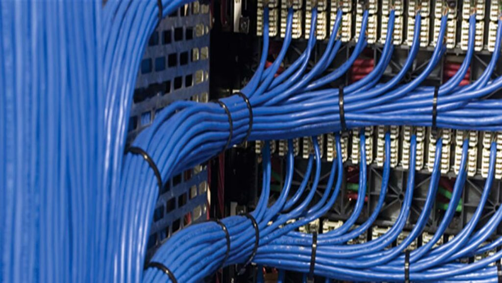
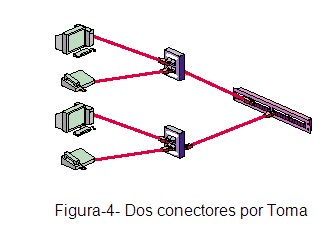
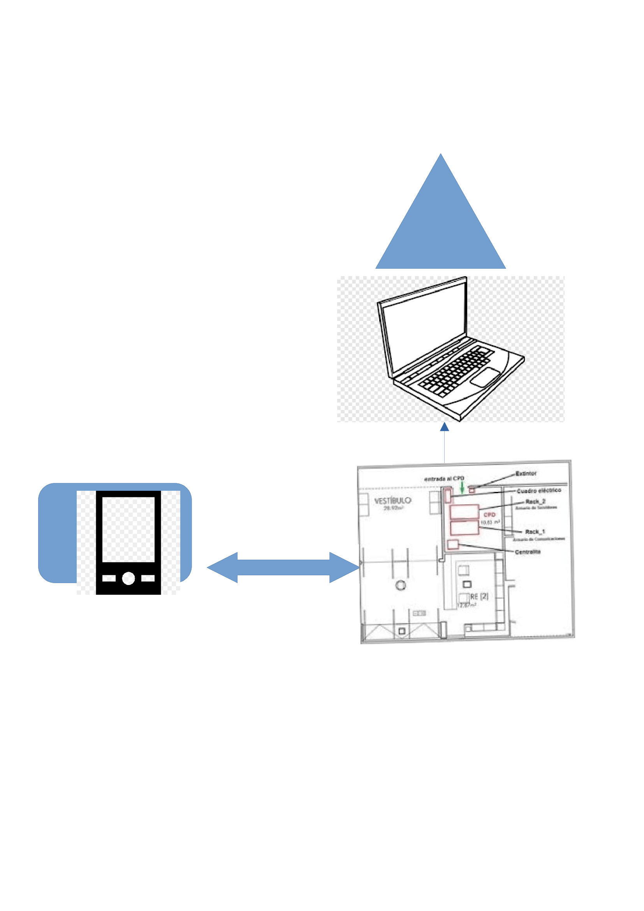

# Pr7.1Conectividad

- [Pr7.1Conectividad](#pr71conectividad)
  - [Conexion del Rack(Armario de Comunicacion) a CPD local](#conexion-del-rackarmario-de-comunicacion-a-cpd-local)
  - [Conexion del Rack(Armario de comunicacion) al PC local](#conexion-del-rackarmario-de-comunicacion-al-pc-local)
  - [Conexion del Rack (Armario de comunicacion) al NETPC local](#conexion-del-rack-armario-de-comunicacion-al-netpc-local)
  - [Conexion del Rack (Armario de comunicacion) al Portatil local](#conexion-del-rack-armario-de-comunicacion-al-portatil-local)
  - [CPD a  Conexion del Rack (Armario de comunicacion) externa](#cpd-a--conexion-del-rack-armario-de-comunicacion-externa)
  - [Conexion del Rack (Armario de comunicacion) a PDA externa](#conexion-del-rack-armario-de-comunicacion-a-pda-externa)

Necesitamos conectar, tanto un PC, NETPC, un portatil y una PDA en otro edificio.

Para conectar los ordenadores que estan en el mismo edificio se pueden conectar a travez de un de cable en la mayoria de ellos, en mi caso decidi poner un rack entre el CPD y los equipos, para centralizar las cosas el cable que se utilizara de rack a CPD sera un cable orizobtal.

Los clables necesarios son

* Cableado Horizontal
* Cableado Vertical 
* Cableado del Campus

## Conexion del Rack(Armario de Comunicacion) a CPD local

Primero hay que conectar del rack al CPD, para esto se utilizara cable fibra optica. Ya que es la forma mas eficiente, en caso de ser necesario esta conexion se puede duplicar para que haya duplicidad. Esto nos permite que los equipos nunca se queden sin conecion ya que los en caso de que uno de los cable de fibra se dañe. Podria traspasarse la conexion al cable subsidiario. El tipo de clave que usare para la intercixion.

Depedende de la distamcia, pero suponiendo que en este caso el edificio solo tiene dos plantas se establecera la conexion con el cable ajustable, en caso de que la distamcia sea mayor o requiera de de una mayor conectividad se usara el cable holgado. Teniendo en cuenta que estos cables no tienen conectorizacion directa, esto seria posible utilizando un adaptador al switch que permita la conexion de fibra optica.

## Conexion del Rack(Armario de comunicacion) al PC local

Se puede hacer o lo que haria yo seria utilizar cable de par-trenzado, este cable ira atarvez de un suelo falso y o un techo falso asta la roseta de la pared. 

En caso de que no haya rosetas en la habitacion, se establecera o una guia oculta, o atravez de la pared por una canaleta. 

Esta coneccion nos permitira establecer la conexion con cierto aislamindo, para e tipo de clable utilizaria o sftpo sstp en funcion de la necesidad de aislamiento del cable. De la roseta al PC se utilizra un cable utp o ftp en unfion de la cabeza ya que el blindaje extra implica que la cabeza cambie y sea necesario una cabeza blindada 

## Conexion del Rack (Armario de comunicacion) al NETPC local

En este caso podemos conectarlo de la misma forma que el anterior, ya que por lo generar se siele utilizar este tipo de dispositivos por red ethernet. Esto establece que necesitas el mismo cable de par-trenzado con rj45 de cabeza.

## Conexion del Rack (Armario de comunicacion) al Portatil local

En este caso, se puede conectar de dos formas, o utilizando un punto de acceso wifi compatible con el portatil y la mas rapido posible, la 2,5, la 5 o la 6. Tambien la conexion se puede establecer a travez de la roseta, de la misma forma anteriormente mencionada, por cable par-trenzado con cabeza RJ-45. 

Este equipo es el mas versatil, ya que permite dos tipo de conexiones.

## CPD a  Conexion del Rack (Armario de comunicacion) externa 

En este caso hay que salir del edificio, esto establece que necesitamos una conexion de campus.

Para ello utilizare fibra o en su defecto par-trenzado, pero este ultimo es menos rentable ya que el par-trenzado puede absover ruido, tanto del hambiente, como de los coches que generan ruido electroestatico.

Esto quiere decir, que la fibra al ser un cable que pasa luz no le suele afectar tanto el rudio electroestatico.

Otra opcion de conexion, es utilizar una conexion inalambrica de punto a punto para trasferir datos pero esta opcion es la mas peligrosa ya que habria mucho ruido.

## Conexion del Rack (Armario de comunicacion) a PDA externa

Para la conexio es necesario un acceso de punto wifi, ya que en este caso solo se podria usar mediante wifi por lo tanto necesiataria de un puerto wifi.

